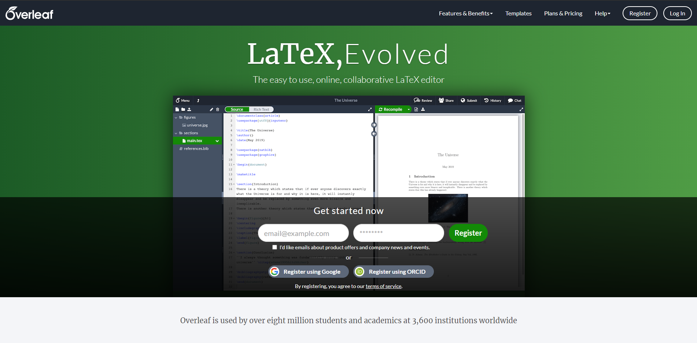
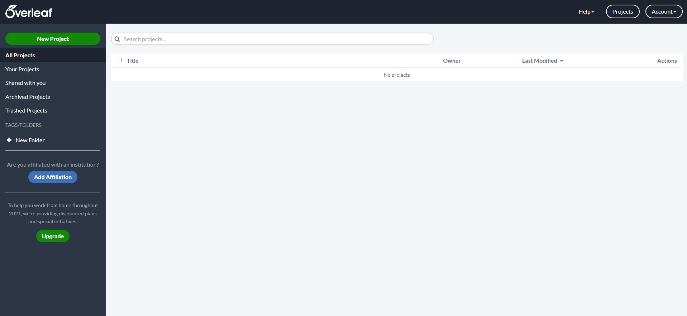
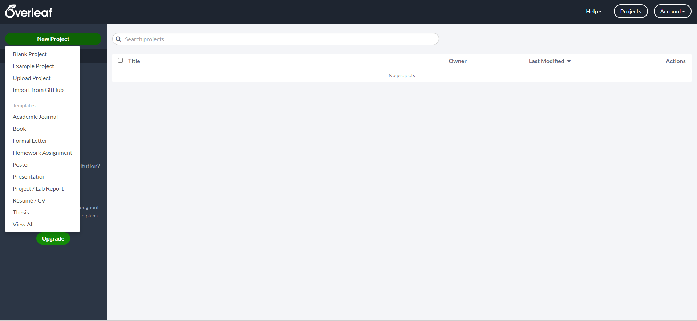
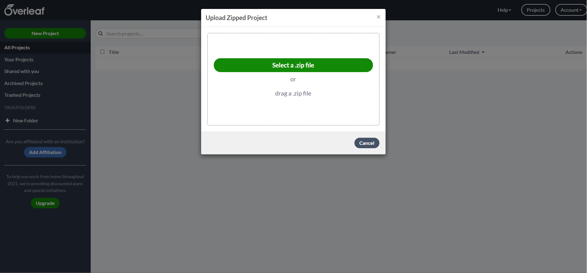
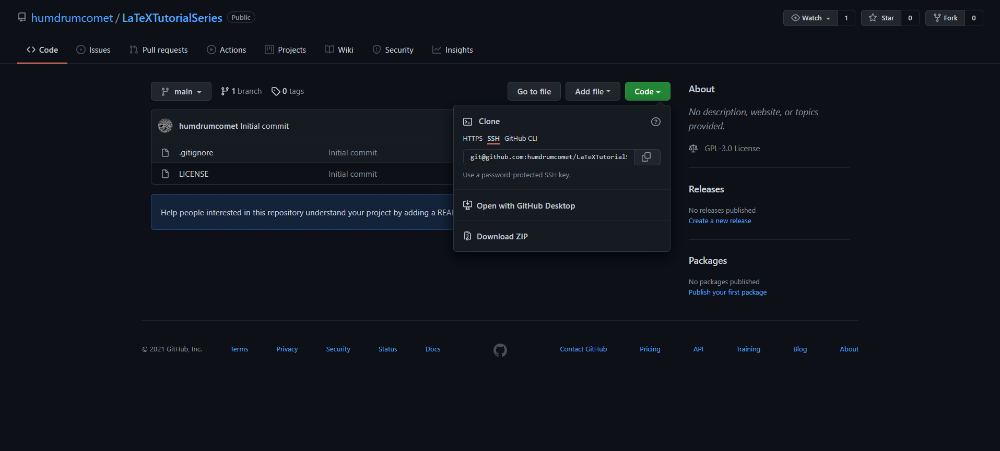

# LaTeX-Workshop

A series of workshops to learn how to make :fire: documents using LaTeX :green_book: 

## Table of contents

Workshop 1: [What is LaTeX?](https://github.com/humdrumcomet/LaTeXIntroduction)\
$~~~~~~~~~~~~~~~~~~~~~$[Let's Code It!](https://github.com/humdrumcomet/LaTeXCodingSession)\
Workshop 2: [Some More Advanced Packages](https://github.com/humdrumcomet/LaTeXAdvancedWorkshop)\
Workshop 3: [LaTeX in Different Environments]()\
Workshop 4: [Fully Reproducible Documents, Literate Programming, and Experimental LaTeX]()

## Prerequisites

Create an Overleaf or sign in using your `Gmail` or `ORCID` account.

## Usage

The following instructions will get you started with this project.

Assuming you are registering with a `Gmail` account:

1. Navigate to the home page of [Overleaf](https://www.overleaf.com/)

2. Press the `Register with Google` button.

3. Fill in the required information and finish up the registration.

4. Once the registration process is done, the user will be navigated to the page shown below.

5. Select the `New Project` green button at the top left corner of the screen.

6. Select the `Upload Project` option from the menu.

7. Open a new browser tab and navigate to the [LaTeXIntroduction](https://github.com/humdrumcomet/LaTeXIntroduction) repository.

8. Select the `Code` green button and then select `Download ZIP` as shown below.

9. In Overleaf, select the `Select a .zip file` button and upload the downloaded zip file from [LaTeXIntroduction](https://github.com/humdrumcomet/LaTeXIntroduction) repository.

10. The LaTeX project is started and you are ready to code.

## Authors

* Aaron English
* Ghassan Arnouk

## License

This project is licensed under the [GNU General Public License](LICENSE)

[LICENSE]: https://github.com/humdrumcomet/LaTeXTutorialSeries/blob/main/LICENSE
